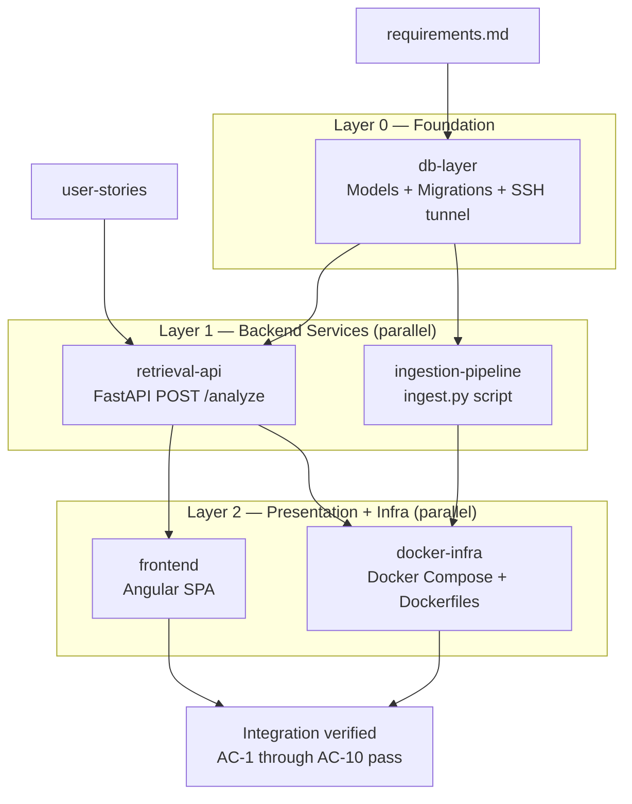

# Thermia MVP — Execution Plan
**Run ID:** 2026-05-19t09-35-00z-thermia-mvp
**Planning depth:** Comprehensive
**Units:** 5 | **Tasks:** 38 | **Layers:** 3

---

## Overview

Thermia is built in three construction layers. Each layer's units may run in parallel; layers are strictly sequential.

| Layer | Units | Can Parallelize |
|---|---|---|
| L0 — Foundation | `db-layer` | No (single unit) |
| L1 — Backend Services | `ingestion-pipeline`, `retrieval-api` | Yes |
| L2 — Presentation + Infra | `frontend`, `docker-infra` | Yes |

**Critical path:** `db-layer` → `retrieval-api` → `frontend`

---

## Workflow Diagram

---

## Unit Definitions

| Unit | Layer | Depends On | Description |
|---|---|---|---|
| `db-layer` | 0 | — | PostgreSQL schema, SQLAlchemy models, Alembic migrations, SSH tunnel connection factory |
| `ingestion-pipeline` | 1 | `db-layer` | Manual ingest script: clone legalize-es, parse MD, chunk, embed (Cohere), upsert to DB |
| `retrieval-api` | 1 | `db-layer` | FastAPI app: auth, PDF extraction, vector+BM25+RRF search, context builder, Groq LLM, structured response |
| `frontend` | 2 | `retrieval-api` | Angular single-view: PDF upload, Analizar button, results renderer, DESIGN.md styling |
| `docker-infra` | 2 | `retrieval-api`, `ingestion-pipeline` | docker-compose.yml, Dockerfiles, nginx.conf, .env.example, README |

---

## Task Tree

### Unit: `db-layer` (Layer 0)

- [ ] **DB-T1** — Create `thermia-back/` project skeleton (FastAPI app structure, pyproject.toml / requirements.txt, folder layout)
  - AC: `thermia-back/` exists with `app/`, `scripts/`, `tests/`, `alembic/` directories; `requirements.txt` present with pinned versions
  - AC: `uvicorn thermia-back/app/main.py` starts without import errors

- [ ] **DB-T2** — Write SQLAlchemy `Document` model (`id` UUID, `content` TEXT, `embedding` VECTOR(1024), `tsvector` TSVECTOR, `metadata` JSONB)
  - AC: Model imports without error; `embedding` column uses `pgvector.sqlalchemy.Vector(1024)`
  - AC: `metadata` defaults to `{}`; `id` uses `gen_random_uuid()`

- [ ] **DB-T3** — Initialize Alembic; write initial migration (`CREATE EXTENSION vector`, `CREATE TABLE documents`, ivfflat + GIN indexes)
  - AC: `alembic upgrade head` applies cleanly on a fresh DB
  - AC: `alembic downgrade base` reverts cleanly
  - AC: `\d documents` shows all 5 columns with correct types

- [ ] **DB-T4** — Write DB connection factory with SSH tunnel support
  - AC: When `THERMIA_ENV=local`, factory creates `sshtunnel.SSHTunnelForwarder` using `SSH_HOST`, `SSH_USER`, `SSH_KEY_PATH`, `SSH_REMOTE_BIND_PORT`
  - AC: When `THERMIA_ENV=production`, factory returns plain SQLAlchemy engine from `DATABASE_URL`
  - AC: Unit test mocks both paths; no real connection needed

- [ ] **DB-T5** — Unit tests: DB connection factory (mock tunnel + mock engine)
  - AC: `pytest tests/test_db.py` passes with 100% coverage of the factory module

---

### Unit: `ingestion-pipeline` (Layer 1)

- [ ] **ING-T1** — Implement GitHub clone step (`subprocess git clone` or `gitpython` into temp dir)
  - AC: Clones `https://github.com/legalize-dev/legalize-es` into a configurable temp directory
  - AC: If repo already exists, performs `git pull` instead of fresh clone

- [ ] **ING-T2** — Implement `.md` file scanner (recursive walk, returns relative paths)
  - AC: Discovers all `.md` files recursively; excludes non-`.md` files
  - AC: Returns list of relative paths from repo root

- [ ] **ING-T3** — Implement Markdown legal structure parser (H1=law, H2=title, H3+=article)
  - AC: Given a sample `.md` file, extracts `{law_id, law_title, article, section, hierarchy_path, year}` correctly
  - AC: Handles files with missing H2 (title defaults to `""`)
  - AC: Unit test covers nested heading structure

- [ ] **ING-T4** — Implement article chunker (800-token threshold → sub-chunks ≤512 tokens, overlap 50)
  - AC: Articles ≤ 800 tokens produce exactly 1 chunk
  - AC: Articles > 800 tokens produce sub-chunks each ≤ 512 tokens
  - AC: Sub-chunks have 50-token overlap between consecutive chunks
  - AC: Each chunk text is prefixed with `[LAW X - ARTICLE Y - TITLE Z]\n\n`
  - AC: `chunk_type` is `"article"` for single chunks, `"sub_article"` for sub-chunks

- [ ] **ING-T5** — Implement Cohere embedding client (batch API calls, 1024d output)
  - AC: Calls `cohere.Client.embed(texts=..., model="embed-multilingual-v3.0", input_type="search_document")`
  - AC: Returns list of 1024-dimensional float vectors
  - AC: API key read from `COHERE_API_KEY` env var

- [ ] **ING-T6** — Implement upsert logic (SQLAlchemy, keyed on `(source_file, article)`)
  - AC: First run inserts N rows
  - AC: Second run with same data produces the same N rows (no duplicates)
  - AC: `tsvector` column populated with `to_tsvector('spanish', content)`

- [ ] **ING-T7** — Write CLI entry point (`scripts/ingest.py`) with `--reset` flag + progress output
  - AC: `python3 scripts/ingest.py` runs end-to-end printing per-file progress
  - AC: `python3 scripts/ingest.py --reset` truncates `documents` before ingesting
  - AC: Errors (per-file) are logged and don't abort the full run

- [ ] **ING-T8** — Unit tests: parser (ING-T3), chunker (ING-T4), upsert idempotency (ING-T6)
  - AC: `pytest tests/test_ingestion.py` passes; covers parser edge cases + chunker boundary conditions + upsert idempotency

---

### Unit: `retrieval-api` (Layer 1)

- [ ] **API-T1** — FastAPI app skeleton (`app/main.py`, router, CORS, health endpoint `GET /health`)
  - AC: `GET /health` returns `{"status": "ok"}`
  - AC: CORS configured to allow Angular dev origin

- [ ] **API-T2** — API key authentication middleware (`Authorization: Bearer <key>` → `THERMIA_API_KEY`)
  - AC: Request without header returns HTTP 401 with Spanish error JSON
  - AC: Request with wrong key returns HTTP 401
  - AC: Request with correct key proceeds

- [ ] **API-T3** — `POST /analyze` endpoint: multipart PDF upload + `pdfplumber` text extraction
  - AC: Rejects non-PDF MIME type with HTTP 422
  - AC: Extracts text from a real PDF correctly
  - AC: Empty-text extraction triggers the legal content guard (next task)

- [ ] **API-T4** — Legal content guard (keyword heuristic: `artículo`, `ley`, `decreto`, `contrato`, `obligación`, `derecho`, `cláusula`)
  - AC: PDF with ≥1 legal keyword passes guard
  - AC: PDF with no legal keywords returns HTTP 422 with Spanish out-of-scope message
  - AC: Empty extracted text returns HTTP 422 with Spanish empty-document message

- [ ] **API-T5** — Intent detection (simple heuristic: detect law name patterns `ley \d+/\d+`, `real decreto`, `estatuto`)
  - AC: Input "contrato de arrendamiento" → metadata filter includes `ley_arrendamientos_urbanos`
  - AC: Input with no specific law → no `law_id` filter applied (search is unfiltered)

- [ ] **API-T6** — Vector search (pgvector cosine, top-20 candidates; query = Cohere embedding of PDF text)
  - AC: Returns list of (chunk, rank) ordered by cosine similarity descending
  - AC: Metadata filter (`jurisdiction="ES"`, optional `law_id`) applied if present

- [ ] **API-T7** — BM25 search (tsvector `ts_rank_cd`, top-20 candidates; Spanish tokenization)
  - AC: `to_tsquery('spanish', ...)` applied correctly
  - AC: Returns list of (chunk, rank) ordered by `ts_rank_cd` descending
  - AC: Same metadata filters as vector search

- [ ] **API-T8** — RRF fusion (`score = Σ 1/(60 + rank_i)`) + deduplication by `(source_file, article)`
  - AC: Given overlapping vector + BM25 result lists, deduplicates correctly
  - AC: RRF scores computed from rank positions, NOT raw similarity scores
  - AC: Top-K (`THERMIA_TOP_K`, default 5) chunks selected

- [ ] **API-T9** — Context builder (format: `[{law_title} | Artículo {article} | {section}]\n\n{content}\n\n---`)
  - AC: Output string matches the exact format for each chunk
  - AC: Chunks joined in RRF rank order

- [ ] **API-T10** — LangChain Groq chain (model: `llama-3.1-8b-instant`; structured output via Pydantic schema)
  - AC: Pydantic schema `AnalysisResult` has fields `resumen: str`, `implicaciones_legales: list[str]`, `fundamento_juridico: list[str]`
  - AC: LangChain chain uses `GROQ_API_KEY` env var
  - AC: Spanish system prompt instructs LLM to respond only in Spanish

- [ ] **API-T11** — Error handling: HTTP 503 on LLM failure (rate limit / timeout / quota)
  - AC: When Groq API raises an exception, endpoint returns HTTP 503 with Spanish message JSON
  - AC: No raw exception traceback exposed to client

- [ ] **API-T12** — Unit tests: auth middleware, guard, RRF logic, context builder
  - AC: `pytest tests/test_api.py` passes; covers auth (3 cases), guard (3 cases), RRF deduplication, context format

---

### Unit: `frontend` (Layer 2)

- [ ] **FE-T1** — Angular environment config (`environment.ts` + `environment.prod.ts`) with `apiUrl` and `apiKey`
  - AC: `ng build` reads env vars injected at build time; no hardcoded keys in source

- [ ] **FE-T2** — `AnalysisService`: HTTP POST `/analyze` with `FormData` + `Authorization: Bearer` header
  - AC: Service sends multipart form data with PDF file
  - AC: Service includes Bearer token from environment config
  - AC: Returns typed `AnalysisResponse` observable

- [ ] **FE-T3** — `AppComponent`: PDF file input (`.pdf` only) + "Analizar" button (disabled until file selected)
  - AC: File input rejects non-PDF files
  - AC: Button disabled with no file; enabled once file selected
  - AC: Clicking "Analizar" calls `AnalysisService.analyze()`

- [ ] **FE-T4** — Loading state + result renderer (resumen, implicaciones_legales, fundamento_juridico sections)
  - AC: Spinner/loading indicator visible while request in flight
  - AC: `resumen` renders as a paragraph block
  - AC: `implicaciones_legales` renders as a bulleted list
  - AC: `fundamento_juridico` renders as a citation list
  - AC: All three sections labeled with Spanish headings

- [ ] **FE-T5** — Error state: out-of-scope (422), auth (401), LLM unavailable (503), network error
  - AC: Spanish error message displayed in styled error block for each error type
  - AC: UI resets to allow retry after error

- [ ] **FE-T6** — SCSS styling per DESIGN.md (colors, typography, spacing, component styles)
  - AC: Color tokens, font stack, and spacing match DESIGN.md spec exactly
  - AC: Responsive layout works at 375px (mobile) and 1280px (desktop)

- [ ] **FE-T7** — Vitest unit tests: `AppComponent` (file input + button state) + `AnalysisService` (HTTP mock)
  - AC: `vitest run` passes; covers button enable/disable, service HTTP call, error display

---

### Unit: `docker-infra` (Layer 2)

- [ ] **INF-T1** — `Dockerfile` for `thermia-back` (Python 3.12 slim, non-root user, `requirements.txt`)
  - AC: `docker build -t thermia-back .` succeeds
  - AC: Container starts FastAPI on port 8000

- [ ] **INF-T2** — `Dockerfile` for `thermia-front` (multi-stage: Node 20 build → nginx:alpine serve)
  - AC: `docker build -t thermia-front .` succeeds
  - AC: Container serves Angular SPA on port 80

- [ ] **INF-T3** — `nginx.conf` for Angular SPA (`try_files $uri /index.html`)
  - AC: Deep-links resolve to `index.html` (SPA routing works)
  - AC: API calls proxied to `thermia-back:8000` via nginx upstream

- [ ] **INF-T4** — `docker-compose.yml` (`thermia-back` port 8000 + `thermia-front` port 80; env_file references)
  - AC: `docker compose up --build` starts both services
  - AC: Frontend loads at `http://localhost:80`
  - AC: Backend health check reachable at `http://localhost:8000/health`

- [ ] **INF-T5** — `.env.example` files for both services (all env vars listed, no real values)
  - AC: `.env.example` in `thermia-back/` lists all 9 env vars from requirements §5
  - AC: `.env.example` in `thermia-front/` lists `apiUrl` + `apiKey`
  - AC: `.env*` is in `.gitignore`

- [ ] **INF-T6** — `README.md` (monorepo root): setup, local dev, ingestion, Docker, env vars
  - AC: New developer can follow README to run the full stack in ≤10 commands

---

## Acceptance Criteria Coverage Table

| Requirements AC | Covered by Tasks |
|---|---|
| AC-1 (ingestion idempotent) | ING-T6, ING-T8 |
| AC-2 (POST /analyze happy path) | API-T3 through API-T11 |
| AC-3 (422 guard) | API-T4 |
| AC-4 (401 auth) | API-T2 |
| AC-5 (no duplicate chunks) | API-T8 |
| AC-6 (1024d embedding) | DB-T2, ING-T5 |
| AC-7 (sub-chunks ≤512 tokens) | ING-T4 |
| AC-8 (frontend renders all sections) | FE-T4, FE-T7 |
| AC-9 (docker compose up works) | INF-T4 |
| AC-10 (no hardcoded secrets) | DB-T4, FE-T1, INF-T5 |

---

## Pre-Mortem Risk Questions

> *(requirements-intelligence plan-stage variant — ≤3 questions)*

**PR-1 — First failure point:** The Cohere embedding API call in `ING-T5` is the most likely first breakage. If `COHERE_API_KEY` is misconfigured or the `input_type` parameter differs from the query-time embedding call (`search_query` vs `search_document`), vector search will return junk results silently. **Mitigation:** Add an integration smoke test to `ingest.py` that embeds a single test string and verifies dimension=1024.

**PR-2 — Boundary that forces re-plan:** The `db-layer` → `retrieval-api` interface (vector dimension). If `DB-T2` sets `VECTOR(1024)` incorrectly, all of L1 must be rebuilt. **Mitigation:** DB-T3's migration is the contract; `retrieval-api` must validate dimension at startup via `SELECT vector_dims(embedding) FROM documents LIMIT 1`.

**PR-3 — Weakest acceptance criterion:** `API-T7` (BM25 search) — the AC says "returns list ordered by ts_rank_cd" but doesn't test Spanish tokenization quality. If `to_tsvector('spanish', ...)` doesn't stem legal terms correctly, BM25 results will be poor. **Mitigation:** Add a unit test with a known Spanish legal phrase (e.g. "arrendamiento") and assert the ts_rank_cd score is non-zero.
