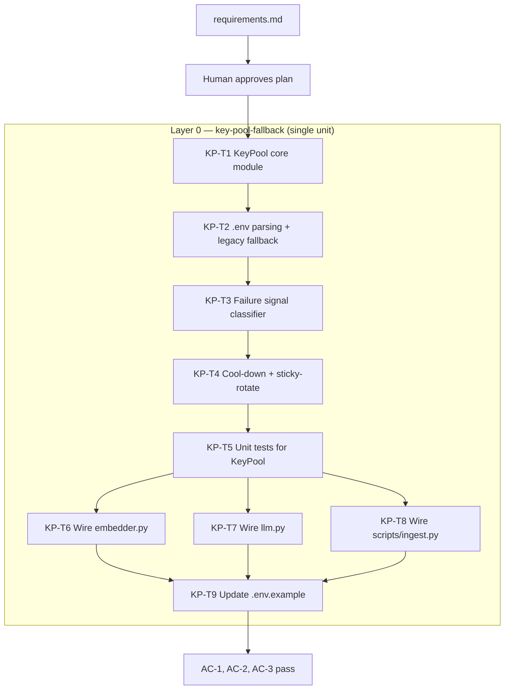

# API Key Fallback System — Execution Plan

**Run ID:** `2026-05-19t15-11-46z-api-key-fallback`
**Planning depth:** Standard
**Project type:** brownfield (Python/FastAPI backend `thermia-back/`)
**Units:** 1 | **Tasks:** 9 | **Layers:** 1
**Source requirements:** `aidlc-docs/inception/requirements/2026-05-19t15-11-46z-api-key-fallback-requirements.md`

---

## 1. Overview

We are adding a provider-agnostic API-key fallback layer to the existing
`thermia-back/` Python service. It composes **above** the in-key retry budget
already present in `embedder.py` and rotates to the next healthy key when a
Cohere or Groq account exhausts. Keys are configured as JSON arrays in
`.env`; legacy single-key variables continue to work. There is no frontend
change, no schema change, and no new HTTP endpoint.

Because the feature is a **single backend module** wired into three existing
call sites (`embedder.py`, `llm.py`, `scripts/ingest.py`), this plan uses
**one unit** (`key-pool-fallback`) with **one construction layer**. The unit
is sliced vertically: the `KeyPool` core + its unit tests land first (so
tests can verify rotation logic in isolation), then the three call sites
are migrated, then `.env.example` documentation closes the unit.

## 2. Architecture Decisions

1. **Single unit, single layer.** All changes are within `thermia-back/` and
   share one Python import graph. Layer-parallelism would offer no real win
   and would risk import-cycle pain between the new `key_pool` module and
   its three callers. One unit, sequential tasks, vertical slice.
2. **`KeyPool` core lands before call-site migration.** Tests for the pool
   are pure-Python (no `cohere`/`groq` HTTP), so they verify rotation,
   cool-down, sticky behaviour, concurrency, and legacy fallback **before**
   any production code path depends on the pool. This matches the
   `planning-and-task-breakdown` "build foundations first" rule.
3. **Threading lock, not asyncio lock.** `scripts/ingest.py` is synchronous,
   and FastAPI request handlers in `embedder.py` / `llm.py` already run
   blocking `cohere.Client` / `ChatGroq` calls in worker threads. A
   `threading.Lock` covers both; an `asyncio.Lock` would not cover the
   ingest script. (Final call deferred to construction per requirements
   §7, but this is the recommended path.)
4. **No persistence of cool-down state.** Per FR-4, cool-downs are
   in-process only. A process restart re-pools every key. This keeps the
   blast radius of the feature inside one module.
5. **One Cohere `cohere.Client`, rebuilt on rotation.** Per FR-8. The
   module-level reference stays; only its underlying client object is
   swapped when the pool rotates.

## 3. Workflow Diagram

## 4. Unit Definitions

| Unit | Layer | Depends On | Description |
|---|---|---|---|
| `key-pool-fallback` | 0 | — | New `app/retrieval/key_pool.py` module + integration into `embedder.py`, `llm.py`, `scripts/ingest.py`; unit tests; `.env.example` update. |

## 5. Task Tree

### Unit: `key-pool-fallback` (Layer 0)

- [ ] **KP-T1** — Create `KeyPool` class skeleton in `thermia-back/app/retrieval/key_pool.py`
  - AC: File exists; class `KeyPool` defined with public methods `current() -> str`, `mark_failed(reason) -> None`, `healthy_count() -> int`, and class-method `from_env(provider: str)`.
  - AC: Class accepts an explicit `keys: list[str]` constructor argument (per NFR-3 testability).
  - AC: A `FailureReason` enum is defined in the same module with members `RATE_LIMIT_429`, `COHERE_TRIAL_QUOTA`, `GROQ_DAILY_QUOTA`, `PERSISTENT_5XX`.
  - AC: `from thermia-back.app.retrieval.key_pool import KeyPool, FailureReason` succeeds.
  - Files: `thermia-back/app/retrieval/key_pool.py`
  - Depends on: — (foundation)

- [ ] **KP-T2** — Implement `.env` parsing with JSON-array form and legacy-single-key fallback (FR-2, FR-6 boot path)
  - AC: `KeyPool.from_env("cohere")` reads `COHERE_API_KEYS` as JSON array; whitespace and single/double quotes tolerated.
  - AC: If `COHERE_API_KEYS` is absent but `COHERE_API_KEY` is set, the legacy scalar is used as a one-element pool and a one-time WARN log `event=key_pool.legacy_var_used` is emitted.
  - AC: If both are absent OR the JSON array is empty `[]`, `ValueError` is raised with a message naming the missing variable and referencing `.env.example`.
  - AC: Malformed JSON raises `ValueError` naming the variable.
  - Files: `thermia-back/app/retrieval/key_pool.py`
  - Depends on: KP-T1

- [ ] **KP-T3** — Implement failure-signal classifier (FR-3)
  - AC: A pure function `classify_failure(exc_or_text: str | Exception) -> FailureReason | None` exists.
  - AC: HTTP-429 / "rate limit" substring → `RATE_LIMIT_429`.
  - AC: Body containing `"Trial key"` AND (`"limited to"` AND `"API calls"`) → `COHERE_TRIAL_QUOTA`.
  - AC: Body containing `"daily"` AND (`"token"` OR `"quota"`) → `GROQ_DAILY_QUOTA`.
  - AC: HTTP 5xx text → `PERSISTENT_5XX`.
  - AC: Anything else (e.g. HTTP 400/401/403 with no rate-limit text) → `None` (caller must surface the original exception, NOT rotate).
  - Files: `thermia-back/app/retrieval/key_pool.py`
  - Depends on: KP-T1

- [ ] **KP-T4** — Implement cool-down dict + sticky-then-rotate cursor + thread-safe `mark_failed` (FR-4, FR-5, NFR-5)
  - AC: `mark_failed(reason)` advances to the next healthy key in declaration order; the same key is reused across calls until it fails (sticky behaviour).
  - AC: Failed keys enter cool-down for `cooldown_seconds` (constructor arg; defaults `2592000` for cohere / `86400` for groq, overridable via `COHERE_KEY_COOLDOWN_SECONDS` / `GROQ_KEY_COOLDOWN_SECONDS`).
  - AC: A failed key re-enters the pool at its original priority index once `time.time() >= failed_at + cooldown_seconds`.
  - AC: All mutating methods are guarded by a `threading.Lock`; 50 concurrent threads marking the same key produce exactly one cursor advance.
  - AC: Wrap-around: if all keys past the cursor are in cool-down, the cursor wraps to the first healthy key from the start of the list.
  - AC: `healthy_count() == 0` raises a documented exception `AllKeysExhaustedError(provider: str)` when callers next ask for `current()`.
  - Files: `thermia-back/app/retrieval/key_pool.py`
  - Depends on: KP-T1, KP-T2, KP-T3

- [ ] **KP-T5** — Unit tests for `KeyPool` covering AC-1 of requirements (mandatory)
  - AC: New file `thermia-back/tests/retrieval/test_key_pool.py` exists and runs under `pytest`.
  - AC: All 11 scenarios from requirements §5 AC-1 are covered as separate test cases, namely: boot fail-fast on zero keys; rotation on 429; rotation on Cohere Trial-key body; rotation on Groq daily-token body; rotation on persistent 5xx; non-rotation on 400/401/403; `AllKeysExhaustedError` when pool exhausted; cool-down expiry restores key (mock `time.time`); sticky-then-rotate reuse across consecutive calls; 50-concurrent-thread test producing exactly one rotation event; legacy `COHERE_API_KEY=…` scalar treated as one-element pool with WARN log.
  - AC: Tests use mocked provider clients (no network).
  - AC: `pytest thermia-back/tests/retrieval/test_key_pool.py` passes; no test scans raw key material into output (assert via `caplog` regex per AC-3).
  - AC: Structured-log emission asserted: `key_pool.rotated` (INFO, once per rotation), `key_pool.degraded` (WARN, once per transition to 1 healthy), `key_pool.exhausted` (ERROR, once per transition to 0 healthy).
  - Files: `thermia-back/tests/retrieval/test_key_pool.py`, `thermia-back/tests/retrieval/__init__.py` (if missing)
  - Depends on: KP-T4

- [ ] **KP-T6** — Wire `KeyPool` into `app/retrieval/embedder.py` (FR-8, FR-9 row 1)
  - AC: Module-level `cohere.Client` is rebuilt from `KeyPool.current()` whenever the pool rotates (rebuild on rotation, not per call).
  - AC: The existing in-key 3-retry budget (10/30/60 s back-off) runs **first**; rotation occurs only after that budget is exhausted, never on the first 429.
  - AC: When the classifier returns a non-rotating failure (e.g. HTTP 400), the original exception is re-raised without rotating.
  - AC: When `AllKeysExhaustedError` is raised, the existing upstream `POST /analyze` Spanish error path produces `"El servicio de análisis no está disponible temporalmente."` verbatim.
  - AC: `pytest thermia-back/tests/test_retrieval.py` still passes (no regressions).
  - Files: `thermia-back/app/retrieval/embedder.py`
  - Depends on: KP-T5

- [ ] **KP-T7** — Wire `KeyPool` into `app/retrieval/llm.py` (FR-9 row 2)
  - AC: Each `ChatGroq` invocation reads the active key from `KeyPool.current()` (Groq is already rebuilt per call per requirements §1.3).
  - AC: On `GROQ_DAILY_QUOTA` or other rotating signal, the pool rotates and the call is retried once on the new key within the same handler invocation.
  - AC: On `AllKeysExhaustedError`, the upstream Spanish error message is surfaced unchanged.
  - AC: `pytest thermia-back/tests/test_retrieval.py` still passes.
  - Files: `thermia-back/app/retrieval/llm.py`
  - Depends on: KP-T5

- [ ] **KP-T8** — Wire `KeyPool` into `scripts/ingest.py` batch loop (FR-9 row 3)
  - AC: The same singleton `KeyPool` instance used by `embedder.py` is reused (NOT a second pool that double-counts cool-downs).
  - AC: A mid-batch rotation does NOT abort the ingest run: the batch retries on the new key and the run continues without restart.
  - AC: The end-of-run summary still prints total documents inserted (unchanged format).
  - AC: `pytest thermia-back/tests/test_ingestion.py` still passes.
  - Files: `thermia-back/scripts/ingest.py`
  - Depends on: KP-T5

- [ ] **KP-T9** — Update `thermia-back/.env.example` (FR-10, AC-2)
  - AC: `COHERE_API_KEY=…` and `GROQ_API_KEY=…` lines replaced by `COHERE_API_KEYS='["…","…"]'` and `GROQ_API_KEYS='["…","…"]'` with worked two-element examples.
  - AC: A comment block above the new lines documents: (a) legacy-single-key fallback per FR-2, (b) the ≥1-key rule per FR-6, (c) optional `COHERE_KEY_COOLDOWN_SECONDS` / `GROQ_KEY_COOLDOWN_SECONDS` env vars with their defaults (`2592000` / `86400`).
  - AC: `grep -E '^COHERE_API_KEYS=' thermia-back/.env.example` returns one line.
  - Files: `thermia-back/.env.example`
  - Depends on: KP-T6, KP-T7, KP-T8

---

## 6. Acceptance Criteria Coverage Matrix

| Req AC | Source FRs | Covered by tasks |
|---|---|---|
| AC-1 boot fail-fast on zero keys | FR-6 | KP-T2, KP-T5 |
| AC-1 rotation on 429 | FR-3, FR-5 | KP-T3, KP-T4, KP-T5 |
| AC-1 rotation on Cohere Trial-key signal | FR-3 | KP-T3, KP-T5 |
| AC-1 rotation on Groq daily-token signal | FR-3 | KP-T3, KP-T5 |
| AC-1 rotation on persistent 5xx | FR-3 | KP-T3, KP-T5 |
| AC-1 non-rotating 4xx | FR-3 | KP-T3, KP-T5 |
| AC-1 all-keys-exhausted exception | FR-6 | KP-T4, KP-T5 |
| AC-1 cool-down expiry restores | FR-4 | KP-T4, KP-T5 |
| AC-1 sticky-then-rotate | FR-5 | KP-T4, KP-T5 |
| AC-1 concurrency (50 threads → 1 rotation) | NFR-5 | KP-T4, KP-T5 |
| AC-1 legacy var treated as 1-element pool | FR-2 | KP-T2, KP-T5 |
| AC-2 `.env.example` updated | FR-10 | KP-T9 |
| AC-3 rotation INFO log (FR-7 fields) | FR-7 | KP-T4, KP-T5 |
| AC-3 degraded WARN once per transition | FR-6 | KP-T4, KP-T5 |
| AC-3 exhausted ERROR once per transition | FR-6 | KP-T4, KP-T5 |
| AC-3 no raw keys in logs | NFR-2 | KP-T4, KP-T5 |

---

## 7. Risks and Mitigations

| Risk | Impact | Mitigation |
|---|---|---|
| `embedder.py` already has 3-retry back-off; rotation could double-retry and slow `POST /analyze`. | Medium — adds latency on rotation path | KP-T6 AC explicitly forbids stacking: rotation only fires **after** the in-key budget is exhausted, never on first 429. |
| Concurrent FastAPI handlers double-rotate when first 429 lands. | Medium — burns a key unnecessarily | KP-T4 lock + 50-thread test (KP-T5). |
| Cohere `cohere.Client` rebuild leaks an HTTP connection pool. | Low | KP-T6 AC: rebuild reassigns the module-level reference (Python GC closes the prior client). Rotation is rare by design. |
| Singleton drift: `embedder.py` and `scripts/ingest.py` build two `KeyPool`s and double-count cool-downs. | Medium | KP-T8 AC explicitly requires reuse of the same instance. |
| Legacy `COHERE_API_KEY` users upgrade to `_KEYS` form but leave the legacy var set. | Low — UX confusion | KP-T2: prefer `_KEYS` when both are present; emit WARN naming the conflict. |

## 8. Plan-Stage Pre-Mortem (requirements-intelligence variant)

Pre-mortem rubric questions (≤3, plan-stage form):

1. **If this plan fails during construction, where will it break first?**
   A) The failure-signal classifier (KP-T3) — string-matching on provider error bodies is fragile if SDK error formats differ from the samples in requirements §FR-3.
   B) The 50-concurrent-thread test (KP-T5) — race between cursor advance and cool-down dict read.
   C) The `embedder.py` integration (KP-T6) — coexistence with the existing 3-retry back-off.
   D) The ingest singleton wiring (KP-T8).
   E) Other.

2. **Which unit boundary, if wrong, will force a re-plan?**
   A) `key-pool-fallback` (only unit) — no boundary risk; if the unit is wrong the whole plan is wrong.
   B) None — single-unit plan, boundary not in play.

3. **Which task has the weakest acceptance criterion?**
   A) KP-T3 (signal classifier) — substring matching against provider strings; risk that real SDK errors don't match the regex.
   B) KP-T7 (Groq wiring) — Groq has no existing in-key retry; "retried once on the new key within the same handler invocation" is the weakest budget statement.
   C) KP-T9 (.env.example) — purely documentation, but `grep -E` AC is precise.
   D) All ACs are testable.

These three plan-risk questions are surfaced here for human review during plan approval. The strongest candidate weakness is **KP-T3** (signal classifier) — if construction discovers SDK error formats that don't match the requirements §FR-3 examples, the task expands. Mitigation: KP-T5 mocks the exact strings from requirements §FR-3, so the spec is locked even if real-world SDK strings later diverge (a separate run can add new patterns without redesign).

## 9. Open Questions for Plan Approval

None blocking. Construction-stage decisions deferred per requirements §7 (lock type, module layout, log formatter choice) remain deferred — none of them change task boundaries.

---

*End of execution plan. Next stage: human approval, then construction.*
