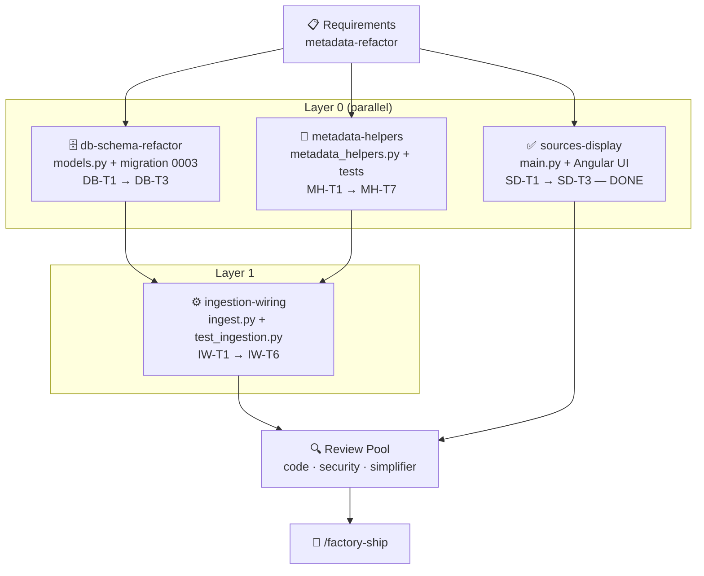

# Execution Plan: Metadata Refactor for Thermia Legal RAG
**Run:** `2026-05-19t20-50-00z-metadata-refactor`
**Date:** 2026-05-19
**Planner:** workflow-planner (inline)
**Depth:** standard

---

## Overview

Three units across two layers. Layer 0 units are independent and can build in
parallel. Layer 1 depends on both L0 units.

| Unit | Layer | Files | Depends On | Status |
|---|---|---|---|---|
| `db-schema-refactor` | 0 | `models.py`, `0003_metadata_refactor.py` | — | **done** ✓ |
| `metadata-helpers` | 0 | `app/ingestion/metadata_helpers.py`, `tests/ingestion/test_metadata_helpers.py` | — | **done** ✓ |
| `sources-display` | 0 | `main.py`, `analysis.service.ts`, `app.html`, `app.scss`, `searcher.py`, `context_builder.py` | — | **done** ✓ |
| `ingestion-wiring` | 1 | `scripts/ingest.py`, `tests/test_ingestion.py`, `requirements.txt` | `db-schema-refactor`, `metadata-helpers` | **done** ✓ |

---

## Workflow Diagram

---

## Unit: `db-schema-refactor` (Layer 0)

### DB-T1 — Update SQLAlchemy `Document` model

- [x] Add `status = Column(VARCHAR(32), nullable=True, default="")` to `Document` class
- [x] Add `legal_rank = Column(VARCHAR(64), nullable=True, default="")` to `Document` class
- [x] Add `jurisdiction = Column(VARCHAR(8), nullable=True, default="")` to `Document` class
- [x] Add `source_metadata_ = Column("source_metadata", JSONB, nullable=True)` to `Document` class
- [x] Use `postgresql.VARCHAR` (not generic `String`) so `__class__.__name__ == 'VARCHAR'` holds
- [x] Keep `metadata_` column unchanged

**Acceptance Criteria:**
- `Document` model imports without error (no DB connection needed)
- `Document.__table__.c['status'].type` is `String` with length 32
- `Document.__table__.c['legal_rank'].type` is `String` with length 64
- `Document.__table__.c['jurisdiction'].type` is `String` with length 8 and `server_default == 'ES'`
- `Document.__table__.c['source_metadata'].type.__class__.__name__ == 'JSONB'`
- Existing `metadata_` column unchanged: still mapped to column name `metadata`

---

### DB-T2 — Write Alembic migration `0003_metadata_refactor.py`

- [x] Create `thermia-back/alembic/versions/0003_metadata_refactor.py`
- [x] Set `revision = "0003"`, `down_revision = "0002"`
- [x] `upgrade()`:
  - `ALTER TABLE documents ADD COLUMN IF NOT EXISTS status VARCHAR(32) DEFAULT ''`
  - `ALTER TABLE documents ADD COLUMN IF NOT EXISTS legal_rank VARCHAR(64) DEFAULT ''`
  - `ALTER TABLE documents ADD COLUMN IF NOT EXISTS jurisdiction VARCHAR(8) DEFAULT 'ES'`
  - `ALTER TABLE documents ADD COLUMN IF NOT EXISTS source_metadata JSONB DEFAULT '{}'`
  - `CREATE INDEX IF NOT EXISTS idx_documents_status ON documents (status)`
  - `CREATE INDEX IF NOT EXISTS idx_documents_legal_rank ON documents (legal_rank)`
  - `CREATE INDEX IF NOT EXISTS idx_documents_jurisdiction ON documents (jurisdiction)`
  - `CREATE INDEX IF NOT EXISTS idx_documents_metadata_gin ON documents USING GIN (metadata jsonb_path_ops)`
- [x] `downgrade()`:
  - `DROP INDEX IF EXISTS idx_documents_metadata_gin`
  - `DROP INDEX IF EXISTS idx_documents_jurisdiction`
  - `DROP INDEX IF EXISTS idx_documents_legal_rank`
  - `DROP INDEX IF EXISTS idx_documents_status`
  - `ALTER TABLE documents DROP COLUMN IF EXISTS source_metadata`
  - `ALTER TABLE documents DROP COLUMN IF EXISTS jurisdiction`
  - `ALTER TABLE documents DROP COLUMN IF EXISTS legal_rank`
  - `ALTER TABLE documents DROP COLUMN IF EXISTS status`

**Acceptance Criteria:**
- Migration file parses without `SyntaxError`
- `alembic upgrade head --sql` (offline mode) produces SQL containing all 4 `ADD COLUMN` statements and all 4 `CREATE INDEX` statements
- `alembic downgrade base --sql` (offline mode) produces SQL with all 4 `DROP COLUMN` and 4 `DROP INDEX` statements
- `down_revision = "0002"` verified (chains correctly from existing migration)

---

### DB-T3 — Test: model columns + migration SQL correctness

- [x] Add to `tests/test_db.py` (extend existing file):
  - `test_document_has_status_column`: assert `String(32)`
  - `test_document_has_legal_rank_column`: assert `String(64)`
  - `test_document_has_jurisdiction_column`: assert `String(8)`
  - `test_document_has_source_metadata_column`: assert `JSONB`, column name `source_metadata`
  - `test_migration_0003_upgrade_sql`: run `alembic upgrade head --sql` in subprocess or via `alembic.config`; assert output contains `ADD COLUMN status` and `CREATE INDEX idx_documents_status`

**Acceptance Criteria:**
- `pytest tests/test_db.py -v` → all tests pass (including new ones)
- No DB connection required in any test

---

## Unit: `sources-display` (Layer 0) ✓ COMPLETE

*All tasks already implemented directly. Included here for review and tracking.*

### SD-T1 — Expose `fuentes` in `/analyze` response (`main.py`) ✓

- [x] After `analyze_with_llm()` returns, build `fuentes` list from `top_docs`:
  - fields per entry: `law_id`, `law_title`, `article`, `section`, `hierarchy_path`
  - reads from existing `doc.metadata_` JSONB (no migration dependency)
- [x] Append `result["fuentes"] = [...]` before `JSONResponse(content=result)`

**Acceptance Criteria:**
- `POST /analyze` response contains a `fuentes` array
- Each entry has `law_id`, `law_title`, `article`, `section`, `hierarchy_path` keys
- Empty list when no documents retrieved (not null)

---

### SD-T2 — Update Angular service + interface (`analysis.service.ts`) ✓

- [x] Add `Fuente` interface: `{ law_id, law_title, article, section, hierarchy_path: string }`
- [x] Add `fuentes: Fuente[]` to `AnalysisResponse` interface

**Acceptance Criteria:**
- TypeScript compiles without errors
- `AnalysisResponse.fuentes` typed as `Fuente[]`

---

### SD-T3 — Render "Fuentes Consultadas" card (`app.html` + `app.scss`) ✓

- [x] New `result-card` block rendered only when `r.fuentes?.length` is truthy
- [x] Heading: "Fuentes Consultadas"
- [x] Per source: `law_title` (or `law_id` fallback) as primary label; `hierarchy_path` as secondary
- [x] Styles: `.source-list`, `.source-item`, `.source-title`, `.source-path` — matches existing design system tokens

**Acceptance Criteria:**
- Card hidden when `fuentes` is empty or absent
- `law_title` shown; falls back to `law_id` when title is blank
- `hierarchy_path` shown only when non-empty

---

## Unit: `metadata-helpers` (Layer 0) ✓ COMPLETE

### MH-T1 — Create `app/ingestion/` sub-package skeleton

- [x] Create `thermia-back/app/ingestion/__init__.py` (empty)
- [x] Create `thermia-back/app/ingestion/metadata_helpers.py` with module docstring and imports:
  - `import hashlib`, `import logging`, `import re`, `from typing import Optional`
  - `import yaml`

**Acceptance Criteria:**
- `from app.ingestion.metadata_helpers import parse_frontmatter` succeeds without error
- No DB or Cohere import in the module

---

### MH-T2 — Implement `parse_frontmatter(md_text: str) -> tuple[dict, str]`

- [x] Detect leading `---\n…\n---` block (regex: `^---\n(.*?)\n---\n`  with `re.DOTALL`)
- [x] On match: `yaml.safe_load(captured_yaml)` inside `try/except`
  - On success: return `(parsed_dict, remaining_text)`
  - On `yaml.YAMLError` or any exception: `log.warning(...)`, return `({}, original_md_text)`
- [x] On no match (no frontmatter): return `({}, md_text)` unchanged
- [x] Handle edge case: missing closing `---` → no match → return `({}, md_text)`
- [x] Handle edge case: `yaml.safe_load` returns non-dict (e.g. scalar) → treat as `{}` + WARNING

**Acceptance Criteria (from requirements AC-1 to AC-3):**
- `parse_frontmatter("---\ntitle: X\n---\n# H1")` → `({"title": "X"}, "\n# H1")`
- `parse_frontmatter("no frontmatter here")` → `({}, "no frontmatter here")`
- `parse_frontmatter("---\n: broken\n---\n# H1")` → `({}, original_text)` + WARNING logged

---

### MH-T3 — Implement `compute_content_hash(text: str) -> str`

- [x] Normalize: `text.strip().lower()`; collapse whitespace: `re.sub(r'\s+', ' ', normalized)`
- [x] Hash: `hashlib.sha256(normalized.encode("utf-8")).hexdigest()`
- [x] Returns 64-char lowercase hex string

**Acceptance Criteria (AC-4):**
- `compute_content_hash("  Hello  World  ")` == `compute_content_hash("hello world")`
- Return value is exactly 64 characters, all lowercase hex

---

### MH-T4 — Implement `extract_legal_rank(frontmatter: dict, law_title: str) -> str`

- [x] Priority 1: `frontmatter.get("rank", "")` → normalize: lowercase, replace `-` with `_`
  - Map known values: `"real_decreto_ley"`, `"real_decreto"`, `"ley_organica"`, `"ley"`, `"orden_ministerial"`, `"orden"`, `"constitucion"`, `"decreto"`, `"resolucion"`, `"circular"`, `"instruccion"`
  - Unknown rank: return lowercased + hyphen-replaced value as-is
- [x] Priority 2 (if no frontmatter rank): pattern-match `law_title.lower()` (accents normalized via `str.casefold()` or `unicodedata`):
  - Ordered checks (longest/most-specific first to avoid partial matches):
    1. `constitución` → `constitucion`
    2. `ley orgánica` → `ley_organica`
    3. `real decreto-ley` → `real_decreto_ley`
    4. `real decreto` → `real_decreto`
    5. `orden ministerial` → `orden_ministerial`
    6. `resolución` → `resolucion`
    7. `instrucción` → `instruccion`
    8. `decreto` → `decreto`
    9. `orden` → `orden`
    10. `circular` → `circular`
    11. `ley` → `ley`
- [x] If neither source matches → return `""`

**Acceptance Criteria (AC-8, AC-9):**
- `extract_legal_rank({"rank": "real-decreto"}, "")` == `"real_decreto"`
- `extract_legal_rank({}, "Ley Orgánica 3/2007")` == `"ley_organica"`
- `extract_legal_rank({}, "Something unknown")` == `""`

---

### MH-T5 — Implement `normalize_status(raw: str | None) -> str`

- [x] Mapping dict: `{"in_force": "vigente", "derogated": "derogada", "partially_in_force": "parcialmente vigente"}`
- [x] `None` or missing → return `""`
- [x] Known key → return mapped value
- [x] Unknown value → `log.warning("Unknown status value: %r — storing as-is", raw)`; return `raw.lower()`

**Acceptance Criteria (AC-5, AC-6, AC-7):**
- `normalize_status("in_force")` == `"vigente"`
- `normalize_status("derogated")` == `"derogada"`
- `normalize_status("partially_in_force")` == `"parcialmente vigente"`
- `normalize_status("unknown_val")` == `"unknown_val"` + WARNING emitted
- `normalize_status(None)` == `""` (no error, no warning)

---

### MH-T6 — Implement `derive_eli(frontmatter: dict) -> str | None`

- [x] Check `frontmatter.get("eli")` first; if truthy, return it
- [x] Attempt URL extraction from `frontmatter.get("source", "")`:
  - Find `eli/` in the URL; extract everything from `eli/` onwards (strip query params)
  - Example: `"https://boe.es/eli/es/rd/2023/001"` → `"eli/es/rd/2023/001"`
- [x] If neither yields a value → return `None`
- [x] Entire function wrapped in `try/except Exception` → on any error, return `None`

**Acceptance Criteria (AC-10, AC-11):**
- `derive_eli({"source": "https://boe.es/eli/es/rd/2023/001"})` → `"eli/es/rd/2023/001"`
- `derive_eli({"eli": "eli/es/l/2020/5"})` → `"eli/es/l/2020/5"`
- `derive_eli({})` → `None`
- `derive_eli({"source": "https://boe.es/buscar/act.php?id=BOE-A-1835-2348"})` → `None`

---

### MH-T7 — Write `tests/ingestion/test_metadata_helpers.py`

- [x] Create `thermia-back/tests/ingestion/__init__.py`
- [x] Create `thermia-back/tests/ingestion/test_metadata_helpers.py`
- [x] Test class `TestParseFrontmatter`: covers AC-1, AC-2, AC-3 plus:
  - missing closing `---`
  - frontmatter returning non-dict (e.g. bare scalar)
  - frontmatter with list field (stored as-is)
- [x] Test class `TestComputeContentHash`: covers AC-4 plus:
  - empty string
  - already-normalized input
  - unicode text
- [x] Test class `TestExtractLegalRank`: covers AC-8, AC-9 plus:
  - all 11 title-pattern matches
  - unknown frontmatter rank stored as-is
  - empty inputs
- [x] Test class `TestNormalizeStatus`: covers AC-5, AC-6, AC-7 plus:
  - `""` empty string → `""`
  - `"partially_in_force"` → `"parcialmente vigente"`
- [x] Test class `TestDeriveEli`: covers AC-10, AC-11 plus:
  - direct `eli` field
  - non-ELI BOE URL returns `None`
  - malformed source → `None` (no raise)

**Acceptance Criteria:**
- `pytest tests/ingestion/test_metadata_helpers.py -v` → all tests pass
- No DB connection, no Cohere connection in any test
- Test count ≥ 25 (comprehensive coverage of all helper functions)

---

## Unit: `ingestion-wiring` (Layer 1) ✓ COMPLETE

*Depends on: `db-schema-refactor` (models.py updated), `metadata-helpers` (helpers available)*

### IW-T1 — Add `build_retrieval_metadata()` and `build_source_metadata()` to `ingest.py`

- [x] Define `_RETRIEVAL_FIELDS` set: the 15 retrieval metadata keys (from FR-2.1)
- [x] Add `build_source_metadata(frontmatter: dict) -> dict`: returns all frontmatter keys NOT in `_RETRIEVAL_FIELDS`
- [x] Update `chunk_article()` signature to accept `frontmatter: dict = {}` parameter
- [x] Inside `chunk_article()`, construct retrieval metadata dict with all 16 fields (15 from FR-2.1 plus `chunk_type`), calling helpers from `app.ingestion.metadata_helpers`
- [x] Each returned chunk dict now has three keys: `content`, `metadata` (retrieval), `source_metadata`

**Acceptance Criteria:**
- `chunk_article(text, ..., frontmatter={"rank": "ley", "status": "in_force", "department": "Min. Interior"})` returns chunks where:
  - `chunk["metadata"]["legal_rank"] == "ley"`
  - `chunk["metadata"]["status"] == "vigente"`
  - `chunk["metadata"]["content_hash"]` is a 64-char hex string
  - `chunk["source_metadata"]["department"] == "Min. Interior"`
  - `chunk["source_metadata"]` does NOT contain `legal_rank` or `status`

---

### IW-T2 — Wire `parse_frontmatter` into the ingest main loop

- [x] In `parse_legal_structure()`: add call to `parse_frontmatter(md_text)` at the top; pass `body` to the existing line-parsing loop; pass `frontmatter` to `chunk_article()` calls
- [x] `parse_legal_structure()` signature: accept `frontmatter: dict = {}` parameter OR call `parse_frontmatter` internally
  - Preferred: call `parse_frontmatter` internally in `parse_legal_structure` so callers don't change
  - `parse_legal_structure` returns chunks with `source_metadata` populated
- [x] In `main()`: remove the separate `parse_frontmatter` call from the loop (it's now inside `parse_legal_structure`)

**Acceptance Criteria (FR-1.2):**
- Calling `parse_legal_structure` on the BOE-A-1835-2348 example file produces chunks where:
  - `chunk["metadata"]["law_id"]` == `"BOE-A-1835-2348"` (from frontmatter `identifier`)
  - `chunk["metadata"]["official_date"]` == `"1835-11-07"` (from frontmatter `publication_date`)
  - `chunk["source_metadata"]["department"]` == `"Ministerio del Interior"`
  - `chunk["content"]` does NOT contain any `---` frontmatter text

---

### IW-T3 — Implement hash-skip in `upsert_documents()`

- [x] Before the embed call in `main()` (or inside a new `_should_skip_embed(session, stable_id, new_hash)` helper):
  - `SELECT metadata->>'content_hash' FROM documents WHERE id = :id`
  - If result matches `new_hash`: log at DEBUG, skip embed call; set `chunk["embedding"] = None` (sentinel)
  - If result differs or row absent: proceed normally with embed
- [x] In `upsert_documents()`: if `chunk["embedding"] is None`, load existing embedding from DB before merge (to avoid overwriting with NULL)
  - Alt: only set `doc.embedding` if embedding is not None
- [x] Hash-skip SELECT uses the same `session` as the upsert (no extra connection)

**Acceptance Criteria (AC-14, AC-15):**
- Re-running ingest on unchanged corpus: `generate_embeddings` called zero times (all chunks hash-matched)
- Re-running with one changed article: `generate_embeddings` called exactly once for that article's chunks
- Hash-skip logged at DEBUG: `[hash-match] skipped embed for <source_file> | <article>`

---

### IW-T4 — Update `upsert_documents()` for new columns and `source_metadata`

- [x] Update `upsert_documents()` to accept chunks with `source_metadata` key
- [x] In the `Document(...)` constructor call: add `source_metadata_=chunk["source_metadata"]`
- [x] Add real column writes: `status=meta["status"]`, `legal_rank=meta["legal_rank"]`, `jurisdiction=meta["jurisdiction"]`
- [x] Embedding skip: `embedding=chunk.get("embedding")` (None if skipped); add guard: if embedding is None, fetch existing from DB and use that (to avoid NULL overwrite on re-run)

**Acceptance Criteria (AC-16, AC-17):**
- After upsert, `SELECT source_metadata FROM documents WHERE id = :id` returns non-empty JSON with frontmatter informational fields
- After upsert, `SELECT status, legal_rank, jurisdiction FROM documents WHERE id = :id` returns normalized Spanish values
- `metadata` column still contains retrieval metadata (backward compatible)

---

### IW-T5 — Update `requirements.txt`

- [x] Check if `PyYAML` already present: `grep -i pyyaml thermia-back/requirements.txt`
- [x] If absent: add `PyYAML>=6.0` to requirements.txt
- [x] Verify `import yaml` works in the test environment

**Acceptance Criteria:**
- `python3 -c "import yaml; print(yaml.__version__)"` succeeds inside the Docker container or venv
- `requirements.txt` contains exactly one PyYAML entry

---

### IW-T6 — Update `tests/test_ingestion.py` with new test cases

- [x] Add `TestHashSkip` class:
  - `test_unchanged_content_skips_embed`: mock session returning matching hash; assert `generate_embeddings` not called
  - `test_changed_content_generates_embed`: mock session returning different hash; assert `generate_embeddings` called
  - `test_new_document_generates_embed`: mock session returning no row; assert embed called
- [x] Add `TestUpsertSourceMetadata`:
  - `test_source_metadata_written`: mock session merge; assert `doc.source_metadata_` populated from chunk
- [x] Add `TestUpsertRealColumns`:
  - `test_status_column_written`: assert `doc.status` set to `"vigente"` when metadata has `status: "vigente"`
  - `test_legal_rank_column_written`: assert `doc.legal_rank` populated
- [x] Ensure existing `test_ingestion.py` tests still pass (no regressions)

**Acceptance Criteria:**
- `pytest tests/test_ingestion.py -v` → all tests pass including new ones
- No real DB or Cohere connection in any test

---

## Risk Notes (Pre-Mortem)

**Risk 1 — Hash-skip embedding guard (IW-T3/IW-T4):** The trickiest task. When `embedding=None` (hash-match skip), `upsert_documents` must preserve the existing embedding. If `session.merge()` is called with `embedding=None`, pgvector will overwrite the stored vector with NULL. The fix: fetch the existing `embedding` from the DB before merge when hash matches, or use `UPDATE SET metadata=..., source_metadata=..., status=...` (no embedding column). **Mitigation**: IW-T3 AC explicitly states "if embedding is None, load existing from DB" — code-generator must not miss this.

**Risk 2 — Unit boundary for `build_retrieval_metadata`**: Currently spec says it lives in `chunk_article()` in `ingest.py`. If moved to `metadata_helpers.py`, it would import from `ingest.py`'s internal `_ENC` tokenizer — a circular problem. Keep it in `ingest.py` where `_ENC` already lives. **Mitigation**: IW-T1 is explicit that `chunk_article()` calls helpers but lives in `ingest.py`.

**Risk 3 — `parse_legal_structure` + frontmatter integration (IW-T2)**: The function currently only takes `md_text` and `source_file`. Calling `parse_frontmatter` internally changes its pure-text behavior. Tests that mock `md_text` must include (or not include) a frontmatter block. **Mitigation**: AC for IW-T2 uses the BOE example file verbatim — concrete, not abstract.

---

## Acceptance Criteria Summary

| AC | Unit | Description | Status |
|---|---|---|---|
| AC-SD1 | sources-display | `fuentes` array present in `/analyze` response | ✓ |
| AC-SD2 | sources-display | Angular `Fuente` interface typed correctly (9 fields) | ✓ |
| AC-SD3 | sources-display | "Fuentes Consultadas" card renders with badges, ELI link, article/section | ✓ |
| AC-SD4 | sources-display | `searcher.py` filters derogated laws by default (`only_active=True`) | ✓ |
| AC-SD5 | sources-display | `context_builder.py` includes `law_title`, `legal_rank`, `status` in LLM context | ✓ |
| AC-1 | metadata-helpers | `parse_frontmatter` with valid frontmatter | ✓ |
| AC-2 | metadata-helpers | `parse_frontmatter` with no frontmatter | ✓ |
| AC-3 | metadata-helpers | `parse_frontmatter` with malformed YAML → `{}` + WARNING | ✓ |
| AC-4 | metadata-helpers | `compute_content_hash` normalization stability | ✓ |
| AC-5 | metadata-helpers | `normalize_status` known values | ✓ |
| AC-6 | metadata-helpers | `normalize_status` unknown value + WARNING | ✓ |
| AC-7 | metadata-helpers | `normalize_status(None)` == `""` | ✓ |
| AC-8 | metadata-helpers | `extract_legal_rank` frontmatter rank | ✓ |
| AC-9 | metadata-helpers | `extract_legal_rank` title pattern match | ✓ |
| AC-10 | metadata-helpers | `derive_eli` from source URL | ✓ |
| AC-11 | metadata-helpers | `derive_eli({})` == `None` | ✓ |
| AC-12 | db-schema-refactor | Migration upgrade adds 4 columns + 4 indexes | ✓ |
| AC-13 | db-schema-refactor | Migration downgrade removes all | ✓ |
| AC-14 | ingestion-wiring | H1-only documents parsed (no "no articles found" skip) | ✓ |
| AC-15 | ingestion-wiring | Key pool rotates on 429 in `generate_embeddings` | ✓ |
| AC-16 | ingestion-wiring | `source_metadata` column populated from frontmatter | ✓ |
| AC-17 | ingestion-wiring | Real columns `status`, `legal_rank`, `jurisdiction` populated | ✓ |

**Total tests:** 103 (14 `test_db.py` + 41 `test_metadata_helpers.py` + 48 `test_ingestion.py` + 8 `analysis.service.spec.ts`)
