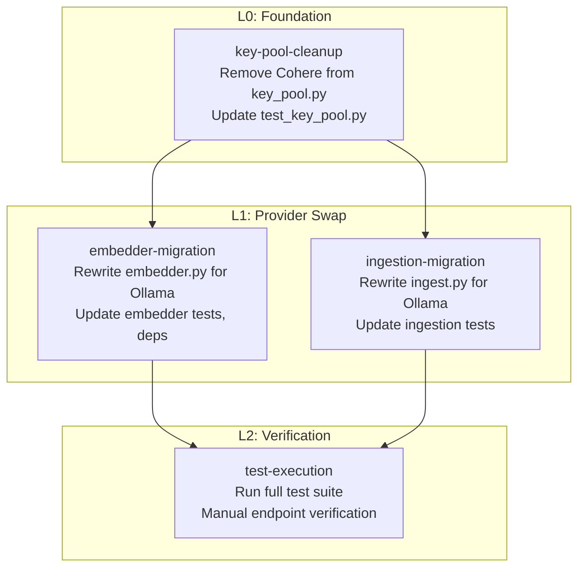

# Execution Plan: Cohere → bge-m3 Embedding Migration

**Run ID:** `2026-05-20t08-41-48z-bge-m3-migration`
**Date:** 2026-05-20
**Planning Depth:** Standard
**Status:** Needs Human Approval

---

## 1. Overview

Replace the Cohere `embed-multilingual-v3.0` embedding provider with self-hosted Ollama `bge-m3` across the entire Thermia codebase. This is a provider swap — no schema changes, no new endpoints, no frontend modifications.

**Scope:** 3 source files + 2 test files + 1 config file
- `thermia-back/app/retrieval/embedder.py` — rewrite
- `thermia-back/app/retrieval/key_pool.py` — Cohere removal
- `thermia-back/scripts/ingest.py` — rewrite
- `thermia-back/requirements.txt` — add ollama, remove cohere
- `thermia-back/.env.example` — remove Cohere vars, add OLLAMA_HOST
- `thermia-back/tests/retrieval/test_key_pool.py` — Cohere test removal
- `thermia-back/tests/test_ingestion.py` — rewrite for Ollama

**Out of scope:** Searcher, fusion, context_builder, llm, db, frontend, docker-infra.

---

## 2. Mermaid Workflow

---

## 3. Unit Decomposition

### Unit 1: `key-pool-cleanup` (L0 — Foundation)

**Purpose:** Remove all Cohere-specific code from KeyPool before the embedder and ingestion pipelines migrate off Cohere.

**Files:**
- `thermia-back/app/retrieval/key_pool.py` — remove `COHERE_TRIAL_QUOTA` enum, `_COHERE_TRIAL_RE` regex, Cohere `classify_failure` branch, `_DEFAULT_COOLDOWNS["cohere"]`
- `thermia-back/tests/retrieval/test_key_pool.py` — remove `test_cohere_trial_quota`, `test_cohere_trial_key_signal`; update provider-agnostic tests (`TestKeyPoolRotation`, `TestFromEnv`, `TestNoRawKeysInLogs`)

| Task | Description | Depends On | ACs |
|------|-------------|------------|-----|
| KP-T1 | Remove Cohere enum, regex, and classify_failure branch from key_pool.py | — | AC-4 (no Cohere refs), AC-3 preserved |
| KP-T2 | Remove Cohere cooldown, update KeyPool constructor | KP-T1 | AC-4, Groq cooldown (86400) intact |
| KP-T3 | Remove Cohere-specific test cases from test_key_pool.py | KP-T1 | AC-1 (all tests pass) |
| KP-T4 | Update provider-agnostic tests (rotation, from_env, logs) | KP-T3 | AC-1, no dangling Cohere references |

### Unit 2: `embedder-migration` (L1 — Provider Swap)

**Purpose:** Replace Cohere client with Ollama client in the embedder module.

**Files:**
- `thermia-back/app/retrieval/embedder.py` — rewrite for `ollama.Client`
- `thermia-back/requirements.txt` — add `ollama>=0.6.2`, remove `cohere`
- `thermia-back/.env.example` — add `OLLAMA_HOST`, remove Cohere env vars
- `thermia-back/tests/retrieval/test_key_pool.py` — `TestEmbedderKeyPool` rewrite (this class lives in test_key_pool.py)

| Task | Description | Depends On | ACs |
|------|-------------|------------|-----|
| EM-T1 | Rewrite embedder.py with ollama.Client singleton, OLLAMA_HOST env var, retry logic | KP-T1 (clean key_pool) | AC-3 (no cohere import), AC-5 (ollama import), AC-7 (OLLAMA_HOST) |
| EM-T2 | Update requirements.txt and .env.example | EM-T1 | AC-9 (ollama in requirements.txt) |
| EM-T3 | Rewrite TestEmbedderKeyPool for Ollama mocking | EM-T1 | AC-1 (all tests pass), 6 test cases per reqs §6.2 |
| EM-T4 | Update test_key_pool.py: TestNoRawKeysInLogs Cohere ref removal | EM-T1 | AC-1 |

### Unit 3: `ingestion-migration` (L1 — Provider Swap)

**Purpose:** Replace Cohere embedding call with Ollama batch embedding in the ingestion pipeline.

**Files:**
- `thermia-back/scripts/ingest.py` — replace `cohere.Client.embed()` with `ollama.embed()`, update `generate_embeddings` signature
- `thermia-back/tests/test_ingestion.py` — rewrite for Ollama mocking

| Task | Description | Depends On | ACs |
|------|-------------|------------|-----|
| IM-T1 | Rewrite generate_embeddings() with ollama.embed(), batch input, retry logic | KP-T1 | AC-6 (ollama.embed call), AC-10 (1024d) |
| IM-T2 | Update main(): remove get_cohere_pool(), init ollama | IM-T1 | AC-6 |
| IM-T3 | Rewrite TestCohereEmbedding and TestKeyRotation test classes | IM-T1 | AC-1, 5 test cases per reqs §6.3 |

### Unit 4: `test-execution` (L2 — Verification)

**Purpose:** Run the full test suite and manual endpoint verification.

| Task | Description | Depends On | ACs |
|------|-------------|------------|-----|
| TE-T1 | Run `pytest thermia-back/tests/ -v` — all tests pass | All above | AC-1 |
| TE-T2 | Manual smoke: POST /analyze returns valid response | TE-T1 | AC-2 |
| TE-T3 | Grep-verify: no cohere refs in embedder.py, key_pool.py, ingest.py | TE-T1 | AC-3, AC-4 |

---

## 4. Layer Schedule

| Wave | Units | Parallelism |
|------|-------|-------------|
| L0 | `key-pool-cleanup` | 1 unit |
| L1 | `embedder-migration`, `ingestion-migration` | 2 units (parallel) |
| L2 | `test-execution` | 1 unit |

---

## 5. Acceptance Criteria Coverage

| AC | Description | Covered By |
|----|-------------|------------|
| AC-1 | All unit tests pass | TE-T1 |
| AC-2 | POST /analyze returns valid response | TE-T2 |
| AC-3 | No cohere import in embedder.py | EM-T1, TE-T3 |
| AC-4 | No cohere reference in key_pool.py | KP-T1, KP-T2, TE-T3 |
| AC-5 | ollama import in embedder.py | EM-T1 |
| AC-6 | ollama.embed call in ingest.py | IM-T1 |
| AC-7 | OLLAMA_HOST env var configures endpoint | EM-T1 |
| AC-8 | Rollback restores Cohere functionality | Not in plan (ops procedure) |
| AC-9 | ollama>=0.6.2 in requirements.txt | EM-T2 |
| AC-10 | Embedding dimension remains 1024 | IM-T1 |

---

## 6. Pre-Mortem Risks

| Risk | Impact | Mitigation |
|------|--------|------------|
| R1: ollama.embed() returns different shape than Cohere | Test failures, runtime errors | Verify response shape in first unit test; adjust parsing before ingestion wiring |
| R2: Embedding space mismatch (bge-m3 ≠ Cohere) | Search quality regression for old docs | Documented and accepted per Q7; user declined re-ingestion |
| R3: Ollama server unavailable during tests | Flaky CI | Mock ollama at the client level; tests never hit real endpoint |
| R4: KeyPool Cohere removal breaks Groq path | Production regression | Keep Groq code intact (separate enum values, separate tests); verify with existing Groq test cases |

---

## 7. Resource Estimate

| Layer | Units | Tasks | Est. Tokens | Est. Wall Time |
|-------|-------|-------|-------------|----------------|
| L0 | 1 | 4 | ~8,000 | ~5 min |
| L1 | 2 | 7 | ~14,000 | ~10 min (parallel) |
| L2 | 1 | 3 | ~3,000 | ~3 min |
| **Total** | **4** | **14** | **~25,000** | **~18 min** |
