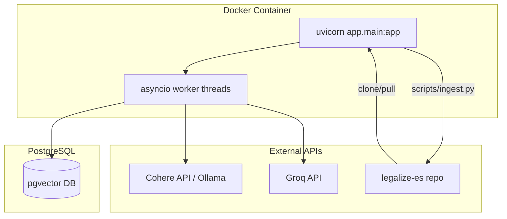

# Architecture — Thermia

## High-Level Architecture

```
┌─────────────────────────────────────────────────────────────────────────────┐
│                            Thermia Backend                                    │
│                                                                               │
│  ┌──────────┐   ┌──────────────┐   ┌────────────────┐   ┌──────────────┐   │
│  │  FastAPI  │──▶│  Retrieval   │──▶│  LLM Analysis   │   │  PostgreSQL  │   │
│  │  REST API │   │  Pipeline    │   │  (Groq/LangCh.) │   │  + pgvector  │   │
│  └──────────┘   └──────────────┘   └────────────────┘   └──────────────┘   │
│       │                │                                                        │
│       │                ├── embedder.py ──────▶ Cohere API / Ollama (target)      │
│       │                ├── searcher.py ──────▶ pgvector + tsvector               │
│       │                ├── fusion.py ────────▶ RRF merge                         │
│       │                ├── context_builder.py ──▶ prompt formatting              │
│       │                └── key_pool.py ──────▶ API key rotation (Cohere/Groq)    │
│       │                                                                           │
│       └─── ingestion pipeline (scripts/ingest.py)                                 │
│            ├── git clone/pull legalize-es repo                                   │
│            ├── parse markdown → chunk → embed → upsert                           │
│            └── Cohere embed-multilingual-v3.0 → Ollama bge-m3 (target)          │
└─────────────────────────────────────────────────────────────────────────────┘
```

## Layers

### 1. API Layer (`app/main.py`)
- **Framework**: FastAPI with lifespan-based engine management
- **Endpoints**: `GET /health`, `POST /analyze`
- **Middleware**: CORS, rate limiting (slowapi), bearer-token auth
- **Auth**: HMAC constant-time comparison, minimum 16-char API key
- **Validation**: PDF magic bytes, content type, file size (10 MB), Spanish legal keyword detection

### 2. Retrieval Layer (`app/retrieval/`)
Six modules forming a chain:
1. **embedder.py** — Query-time embedding via Cohere Client (module-level singleton pool)
2. **searcher.py** — Hybrid search: pgvector cosine ANN + PostgreSQL tsvector BM25
3. **fusion.py** — Reciprocal Rank Fusion (RRF) to merge and rank results
4. **context_builder.py** — Format retrieved documents into LLM-ready context strings
5. **llm.py** — Groq llama-3.1-8b-instant via LangChain with structured JSON output
6. **key_pool.py** — Provider-agnostic API key pool (shared by embedder and LLM)

### 3. Database Layer (`app/db/`)
- **connection.py** — SQLAlchemy engine factory with SSH tunnel support (local dev) vs direct URL (production)
- **models.py** — Document ORM model with pgvector `Vector(1024)` column

### 4. Ingestion Layer (`scripts/ingest.py`)
- Standalone CLI script (not part of the FastAPI app)
- Clones a git repository → parses Markdown into hierarchical chunks → generates embeddings → upserts into DB
- Uses the same Cohere KeyPool singleton as the query API

## Deployment Model



- **Runtime**: Python 3.12-slim Docker container
- **Server**: uvicorn (ASGI) on port 8000
- **Database**: PostgreSQL with pgvector extension (separate host)
- **External APIs**: Cohere (embeddings — TO BE MIGRATED to Ollama bge-m3), Groq (LLM analysis)
- **Config**: Environment-driven via `.env` file (loaded by python-dotenv)

## Key Architectural Boundaries

| Boundary | Mechanism | Migration Impact |
|----------|-----------|-----------------|
| Embedding provider | `embedder.py` module | Replace Cohere client with Ollama HTTP POST |
| API key management | `key_pool.py` | Can be simplified/removed for Ollama (no key needed) |
| Embedding dimension | `Vector(1024)` in DB model | bge-m3 supports 1024-d — no schema change needed |
| Search index | pgvector ivfflat with cosine_ops | No index change if dimension stays 1024 |
| Async execution | `asyncio.to_thread()` for blocking calls | Ollama HTTP calls are also blocking — no change needed |

## Data Flow (Current — Pre-Migration)

```
POST /analyze (PDF)
    │
    ▼
extract text (pdfplumber)
    │
    ├──▶ embedder.get_query_embedding() ──▶ Cohere embed-multilingual-v3.0
    │                                         input_type="search_query"
    │
    ├──▶ vector_search() ──▶ pgvector <=> cosine query
    │
    ├──▶ bm25_search() ────▶ tsvector plainto_tsquery
    │
    ├──▶ rrf_fusion() ─────▶ merge + rank
    │
    ├──▶ build_context() ──▶ prompt formatting
    │
    └──▶ analyze_with_llm() ──▶ Groq llama-3.1-8b-instant → JSON response
```

## Migration-Relevant Architecture Facts

1. **Embedding calls in two places**: `embedder.py` (query-time) and `ingest.py` (ingestion-time) both call Cohere. Both must be migrated.
2. **Different input_type values**: Query uses `search_query`, ingestion uses `search_document` — bge-m3 has no such distinction.
3. **KeyPool is shared**: `get_cohere_pool()` singleton is used by both paths — removal affects both.
4. **1024-d is hardcoded**: Both the ORM model and search queries use `Vector(1024)` — compatible with bge-m3.
