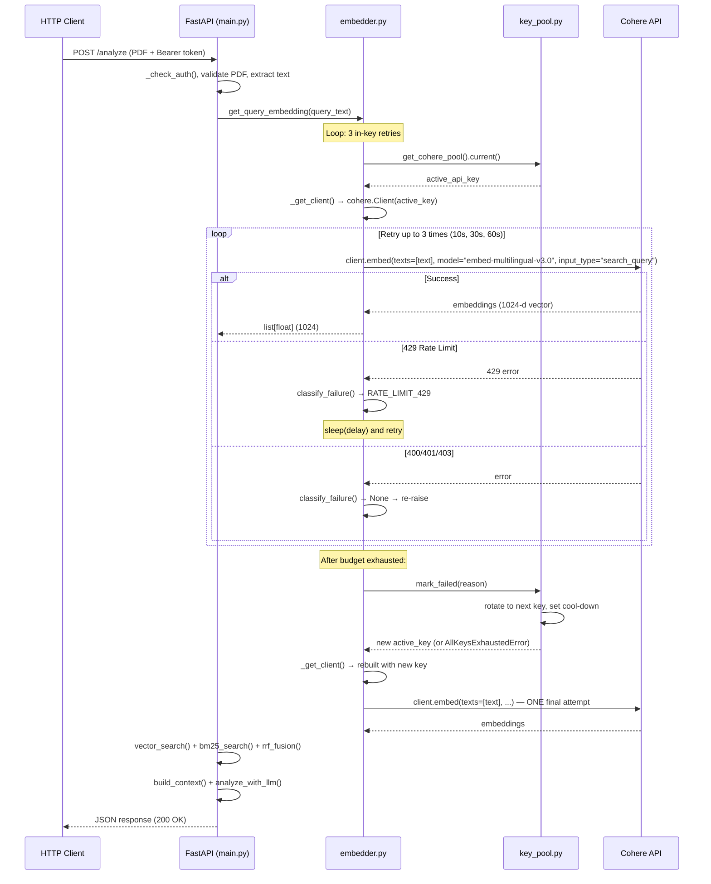
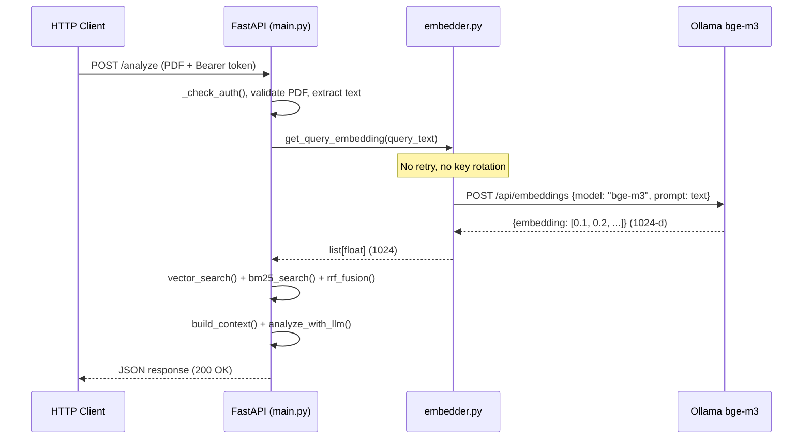
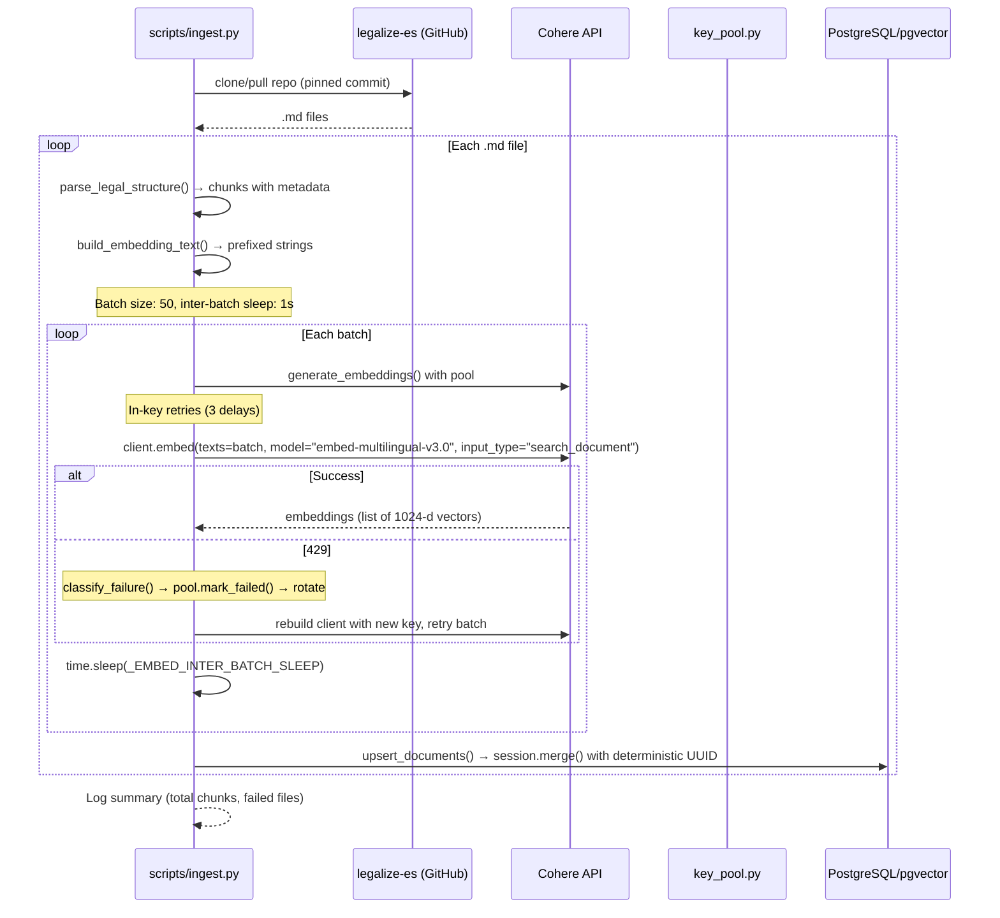
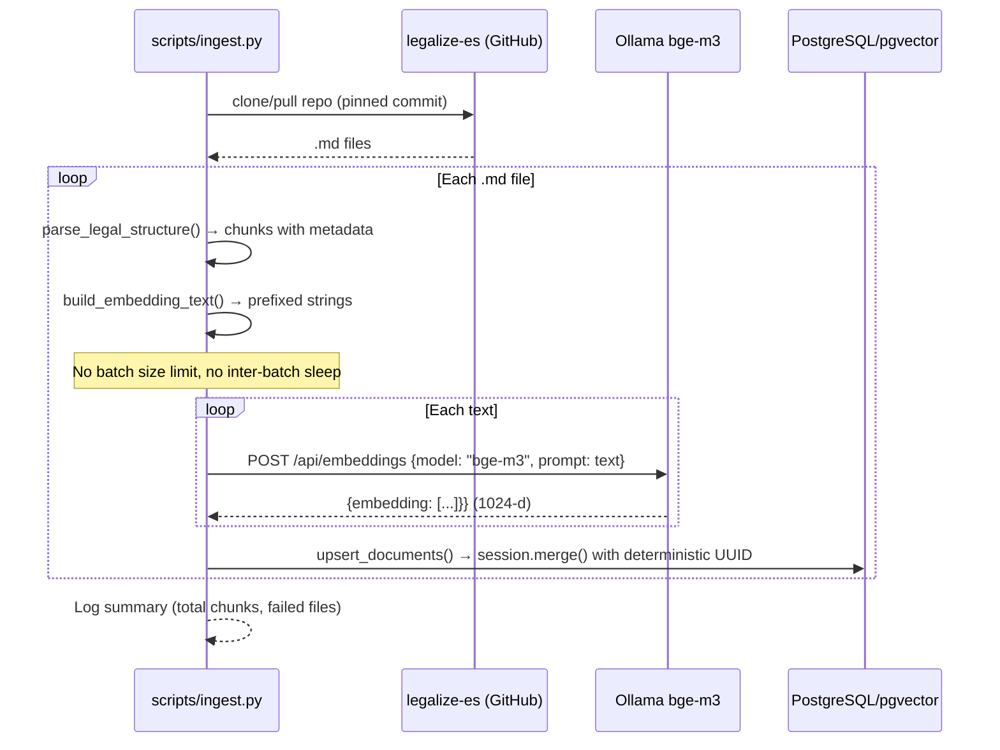
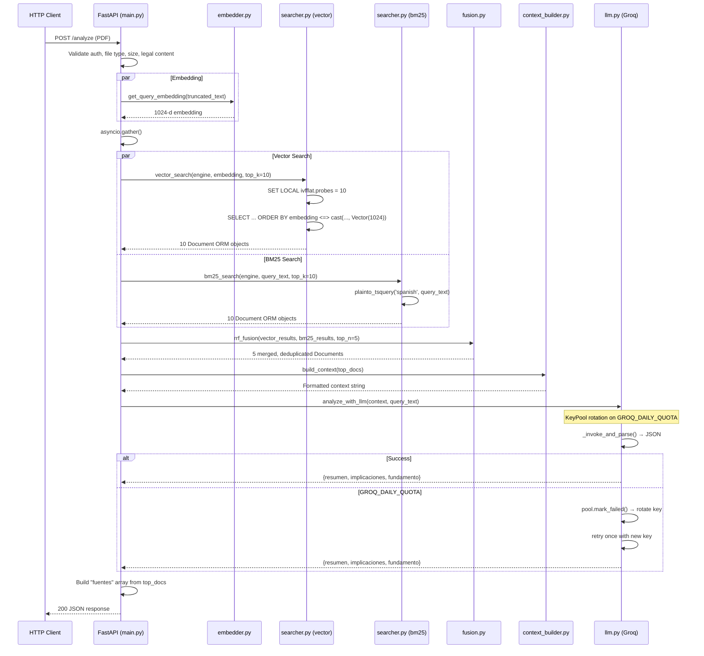

# Interaction Diagrams — Thermia

## Flow 1: Query-Time Embedding (POST /analyze → get_query_embedding)

**Current (Cohere)** — This flow is the primary migration target.

**Target (Ollama bge-m3)**:

---

## Flow 2: Ingestion Pipeline Embedding

**Current (Cohere)** — This flow is also a migration target.

**Target (Ollama bge-m3)**:

---

## Flow 3: Full RAG Analysis Pipeline

This flow shows the complete chain from PDF upload to structured legal analysis.

